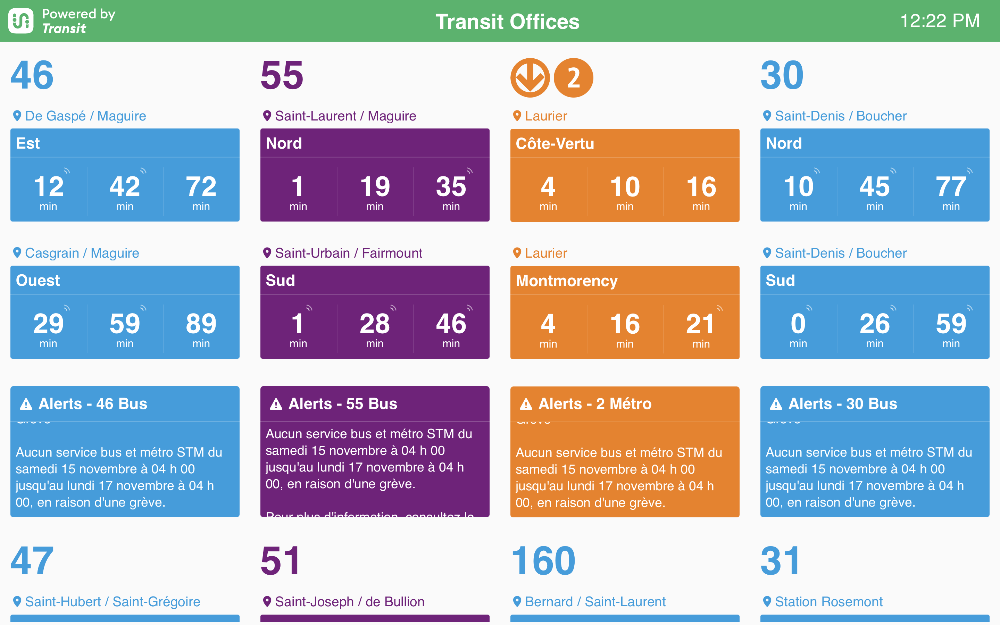

# Transit TV

A real-time transit display application that shows arrival times for nearby public transit.



<div style="text-align: center;">

[](https://transitapp.com)

</div>

> [!IMPORTANT]
> This is a *rewrite* of the original Transit TV application in a more up-to-date stack.
> If you're looking for *my fork* of the original project, have a look at the [legacy branch](https://github.com/jasonad123/Transit-TV/tree/legacy) of this repo.
> If you're looking for the original project, have a look over at [Transit App's account](https://github.com/TransitApp/Transit-TV)

> [!WARNING]  
> Transit TV was built by the Transit team as a fun project to demo our API, usage of this project comes with no guarantee of any kind.

> [!INFO]
> Just as the original Transit TV was built by the Transit team as a fun project, ***this*** version of this project comes with no guarantee of any kind. I am **not** affiliated with Transit, just big fans of their app.

## Prerequisites

- An API key from Transit - [keys can be requested here](https://transitapp.com/apis)
- Node.js (version specified in .node-version)
- pnpm (preferred package manager)
- Docker (optional, for containerized deployment)

## Getting started

1. Request API access

Go to the [Transit API page](https://transitapp.com/apis) and request access to the API. When you have the API key, you can place it in your environment file.

  > `.env` for local development using `pnpm`
  > `.env.docker` for deployment using docker

2. Create your `.env` files

Depending on if you're deploying using `pnpm` or if you're using Docker, create your `.env` file from an example.

For testing/deployment with `pnpm`:

```bash
# create .env for local deployment with pnpm
cp .env.example .env
```

For testing/deployment with Docker:

```bash
# create .env for local deployment with docker
cp .env.docker.example .env.docker
```

## Local testing/deployment

> [!NOTE]
> This project has been migrated to a new stack built on Svelte and SvelteKit. The legacy version (based on AngularJS) is still available but the SvelteKit version is recommended for most new deployments. The warnings above still apply either way.

1. Follow the **getting started** steps

This includes getting an API key from Transit and setting up the `.env` file and cloning this repo locally.

2. Build and run locally

```bash
# Install dependencies
pnpm i

# Build the SvelteKit app
cd svelte-app && pnpm build && cd ..

# Start the server with SvelteKit
USE_SVELTE=true pnpm start
```
The application will be available at http://localhost:8080

For development with hot reload:
```bash
# Terminal 1: Start SvelteKit dev server
cd svelte-app && pnpm dev

# Terminal 2: Start Express backend
pnpm start
```

Then access the app at http://localhost:5173 (Vite dev server with hot reload)

3. Deploy somewhere!

If all looks good, you should be ready to deploy it.

## Deployment with Docker

1. **Configure environment variables:**

   ```bash
   # Review and edit .env.docker file with your API key
   nano .env.docker
   ```

2. **Using Docker Compose:**

   ```bash
   # Production build
   docker compose up -d

   # View logs
   docker compose logs

   # Stop
   docker compose down
   ```

   For development with hot reload:

   ```bash
   docker compose --profile dev up
   ```

3. **Using Docker build directly:**

   ```bash
   # Build the SvelteKit image
   docker build -f Dockerfile.svelte -t transit-tv-svelte .

   # Run the container
   docker run -p 8080:8080 --env-file .env.docker transit-tv-svelte
   ```

The application will be available at http://localhost:8080

### Environment Variables

When running with Docker, you can configure the application using environment variables:

- `NODE_ENV`: Set to `production` for production deployment
- `PORT`: The port the application will listen on (default: 8080)
- `TRANSIT_API_KEY`: Your Transit API key
- `SESSION_SECRET`: Secret for session encryption
- `ALLOWED_ORIGINS`: (Development only) Comma-separated list of allowed CORS origins

#### CORS Configuration (advanced)

**Note:** CORS is automatically disabled in production deployments. In production, SvelteKit and Express run on the same origin (port 8080), so cross-origin requests don't occur and CORS headers are not needed.

CORS is only enabled during local development when running SvelteKit dev server (port 5173) separately from the Express backend (port 8080).

For development, the default allowed origin is `http://localhost:5173`. If you need to allow additional origins during development:

```bash
# Development only - allow SvelteKit dev server
ALLOWED_ORIGINS=http://localhost:5173,http://localhost:8080
```

**Production deployments do not require ALLOWED_ORIGINS configuration.** Each deployment is self-contained and serves both frontend and backend on the same origin.

## Enhancements

### Unattended Setup

This feature allows you to skip the configuration popup on first launch - automatically setting your location, title, and clock setting. You'll still be able to change the settings at any time.

To use unattended setup, simply modify your relevant `.env` file or environment variables depending on your deployment method (modify them in `.env` for local deployment, `.env.docker` for Docker deployments)

Please review the `.env` examples for an overview of all unattended variables available.

## Project structure

```bash
.
├── svelte-app/           # SvelteKit application
│   ├── src/
│   │   ├── routes/       # SvelteKit routes and API endpoints
│   │   ├── lib/          # Components, stores, utilities
│   │   └── app.css       # Global styles
│   ├── static/           # Static assets like images and fonts
│   └── package.json      # SvelteKit dependencies
├── server/
│   ├── api/              # API endpoints
│   ├── config/           # Server configuration
│   ├── components/       # Custom server components
│   └── routes.js         # Express routing
├── .env.example          # Example environment variables
├── .railway-env-template # Example environment variables for Railway deployments
├── Dockerfile            # Docker build file
├── compose.yaml          # Docker Compose file (production)
└── compose.dev.yaml      # Docker Compose (development)
```

## License

See the [LICENSE](LICENSE) file for details.

## Additional Disclaimers

> [!NOTE]
> **Generative AI:** The code for this project was developed with the help of generative AI tools, including Claude and Claude Code. While all outputs have been *lovingly* reviewed and tested, users should validate results independently before use in production environments.
