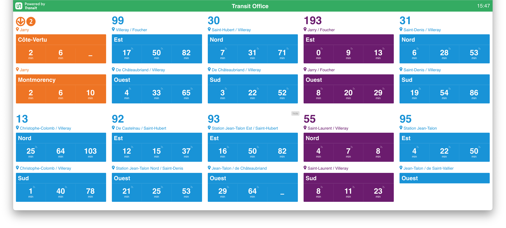
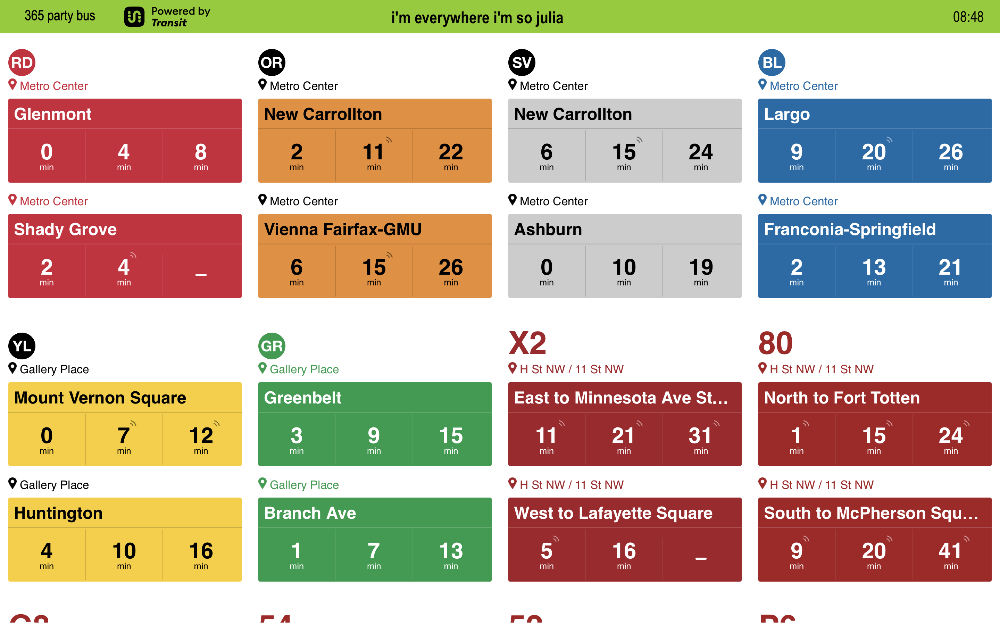

# Transit TV

Use the Transit API to show next departure of a location in big for a TV context.



This branch includes a setup for custom theming of the navbar, shown here being themed to [brat by Charli XCX.](https://en.wikipedia.org/wiki/Brat_(album))



[](https://transitapp.com)

> [!WARNING]  
> Transit TV was built by the Transit team as a fun project to demo our API, usage of this project comes with no guarantee of any kind. 

> [!INFO]
> Just as the original Transit TV was built by the Transit team as a fun project, ***this*** version of this project comes with no guarantee of any kind. I am **not** affiliated with Transit, just big fans of their app.

## Prerequisites

- An API key from Transit - [keys can be requested here](https://transitapp.com/apis)
  - Keep in mind that to have a Transit-TV running 24/7 you'll need a paid API key as the free plan won't be enough.
- Node.js (version specified in .node-version)
- pnpm (preferred package manager)
- Docker (optional, for containerized deployment)

## Getting started
1. Request API access

Go to the [Transit API page](https://transitapp.com/apis) and request access to the API. When you have the API key, you can place it in your environment file. 

> `.env` for local development using `pnpm`

> `.env.docker` for deployment using docker

2. Create your `.env` files

Depending on if you're deploying using `pnpm` or if you're using Docker, create your `.env` file from an example.

For testing/deployment with `pnpm`:

```bash
# create .env for local deployment with pnpm
cp .env.example .env
```

For testing/deployment with Docker:

```bash
# create .env for local deployment with docker
cp .env.docker.example .env.docker
```

## Local testing/deployment

1. Follow the **getting started** steps

This includes getting an API key from Transit and setting up the `.env` file.

2. Test locally

Assuming you have `node` and `pnpm` installed (we recommend using `nodenv` to follow the `.node-version` file):

```bash
# Install dependencies
pnpm i
pnpm build
pnpm start
```
The application will be available at http://localhost:8080

3. Deploy somewhere!

If all looks good, you should be ready to deploy somewhere if you want to use it for a longer amount of time.

## Deployment with Docker

1. Follow the **getting started** steps

This includes getting an API key from Transit and setting up the `.env.docker` file.

2. Deploy in Docker

### Using Docker Compose (recommended)

**Configure your environment variables:**
   
   ```bash
   # Review and edit .env.docker file with your API key
   nano .env.docker
   ```

**Create/review the Docker Compose file at `compose.yml`**

   ```yaml
services:
  transit-tv:
    env_file:
      - .env.docker
    build:
      context: .
      dockerfile: Dockerfile
    image: transit-tv
    container_name: transit-tv
    restart: unless-stopped
    ports:
      - "8080:8080" # Default port for the application is 8080, change the left side if needed
    environment:
      NODE_ENV: "production"
      # These environment variables will override those in .env.docker if set
      # LOG_LEVEL: "info"
    volumes:
      # Persist any data that needs to be saved between container restarts
      - ./logs:/app/logs # change this to your desired log directory
    networks:
      - transit-network
    healthcheck:
      test: ["CMD", "wget", "--spider", "-q", "http://localhost:8080"]
      interval: 30s
      timeout: 10s
      retries: 3
      start_period: 10s
    deploy:
      resources:
        limits:
          cpus: '0.5'
          memory: 512M

networks:
  transit-network:
    driver: bridge
   ```

**Run with Docker Compose:**

   ```bash
   # Start the application
   docker compose up -d

   # View logs
   docker compose logs -f

   # Stop the application
   docker compose down
   ```

The application will be available at http://localhost:8080

### Using Docker run:

```bash
# Build the Docker image
docker build -t transit-tv .

# Run the container
docker run -p 8080:8080 -e TRANSIT_API_KEY=your_api_key_here transit-tv
```

The application will be available at http://localhost:8080

### Environment Variables

When running with Docker, you can configure the application using environment variables:

- `NODE_ENV`: Set to `production` for production deployment
- `PORT`: The port the application will listen on (default: 8080)
- `TRANSIT_API_KEY`: Your Transit API key
- `SESSION_SECRET`: Secret for session encryption
- `ALLOWED_ORIGINS`: Comma-separated list of allowed CORS origins (default: `http://localhost:8080`)

#### CORS Configuration

The application implements CORS (Cross-Origin Resource Sharing) to control which domains can access the API from web browsers. By default, only `http://localhost:8080` is allowed.

To allow additional domains:

```bash
# Single domain
ALLOWED_ORIGINS=https://yourdomain.com

# Multiple domains (comma-separated)
ALLOWED_ORIGINS=http://localhost:8080,https://yourdomain.com,https://staging.yourdomain.com
```

**Important:** Always specify the full URL including protocol (`http://` or `https://`) and port if non-standard.

## Enhancements

### Unattended Setup

This feature allows you to skip the configuration popup on first launch - automatically setting your location, title, and clock setting. You'll still be able to change the settings at any time.

To use unattended setup, simply modify your relevant `.env` file or environment variables depending on your deployment method (modify them in `.env` for local deployment, `.env.docker` for Docker deployments)

The following variables are available:

```
# UNATTENDED_SETUP: Enable automatic setup without user interaction (true/false)
UNATTENDED_SETUP=false

# UNATTENDED_LOCATION: Latitude and longitude coordinates for transit data
# Format: "latitude,longitude" (e.g., "40.7240,-74.0002" for New York City)
UNATTENDED_LOCATION=

# UNATTENDED_TITLE: Display title for the transit screen
UNATTENDED_TITLE=Transit Display

# UNATTENDED_TIME_FORMAT: Time display format
# Options: "HH:mm" (24-hour format) or "hh:mm A" (12-hour format with AM/PM)
UNATTENDED_TIME_FORMAT=HH:mm
```


## Project structure

```
.
├── client/
│   ├── app/              # Main application code
│   ├── components/       # Reusable UI components
│   ├── directives/       # Angular directives
│   ├── services/         # Angular services
│   └── assets/           # Static assets (images, i18n)
├── server/
│   ├── api/              # API endpoints
│   ├── config/           # Server configuration
│   └── components/       # Server components
├── .env.example          # Example environment variables - copy this for local development/deployment
├── .env.docker.example   # Example Docker environment variables - copy this for Docker deployment
├── .eslintrc.js          # ESLint configuration
├── compose.yml           # Docker Compose configuration - copy this for Docker deployment
└── Dockerfile            # Docker build configuration - copy this for Docker deployment
```

## License

See the [LICENSE](LICENSE) file for details.
